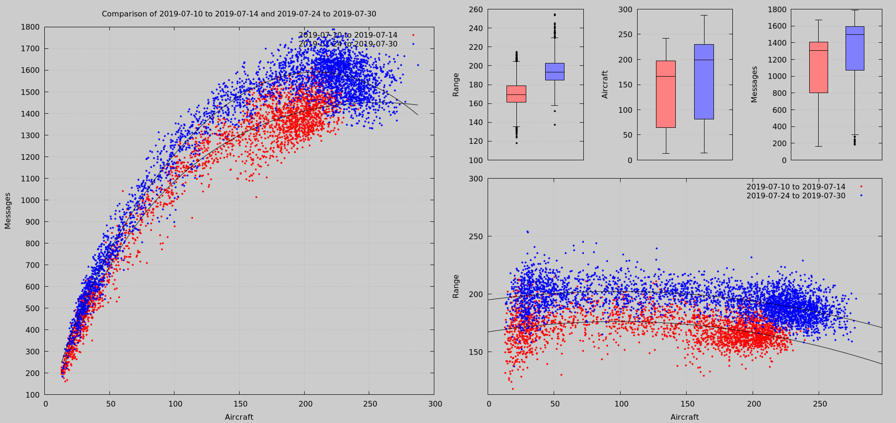
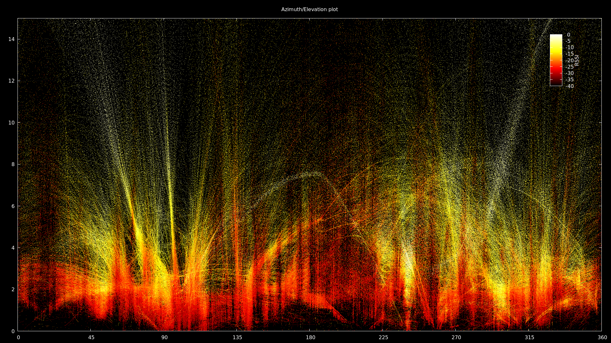
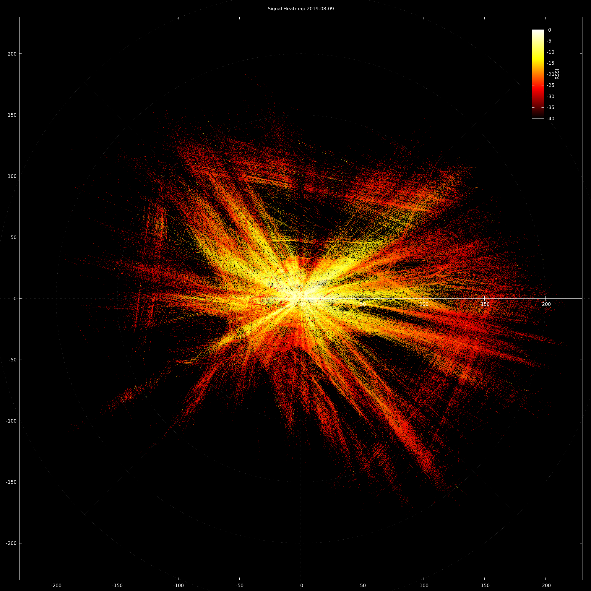
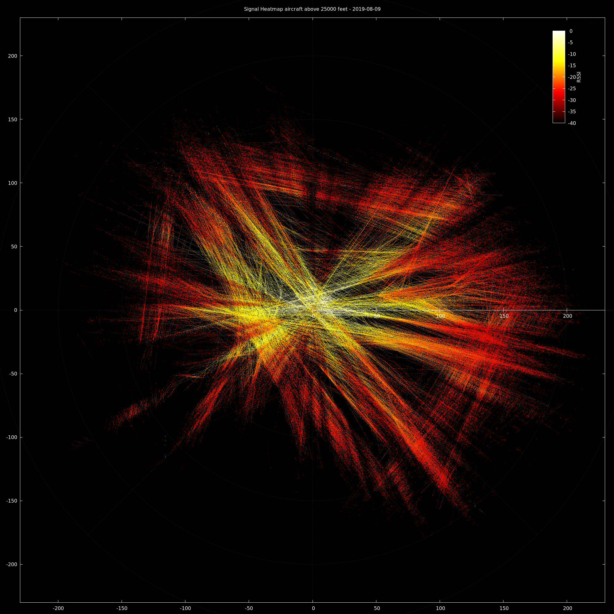
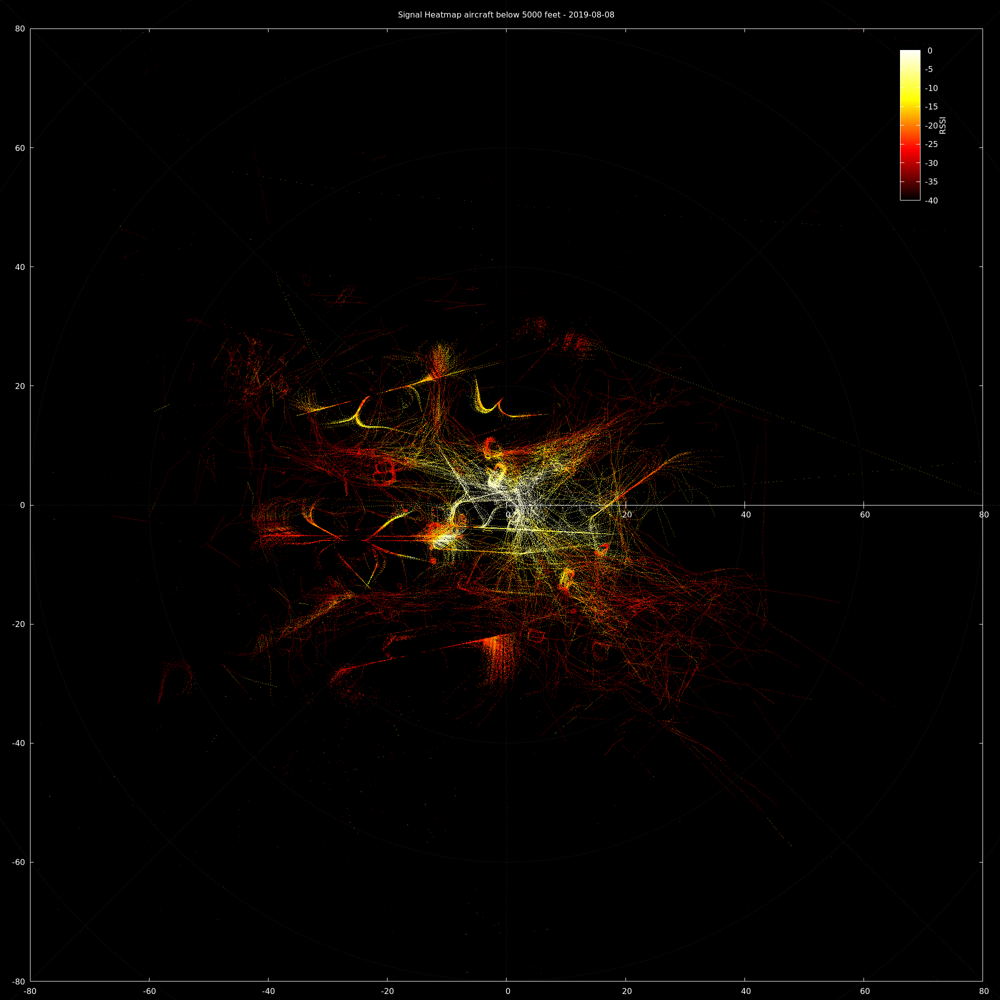
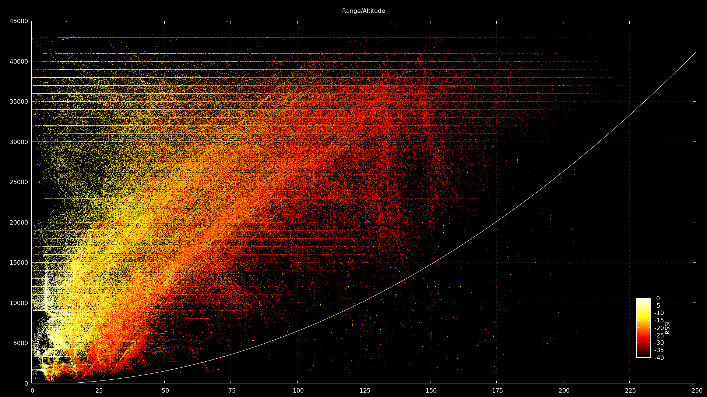
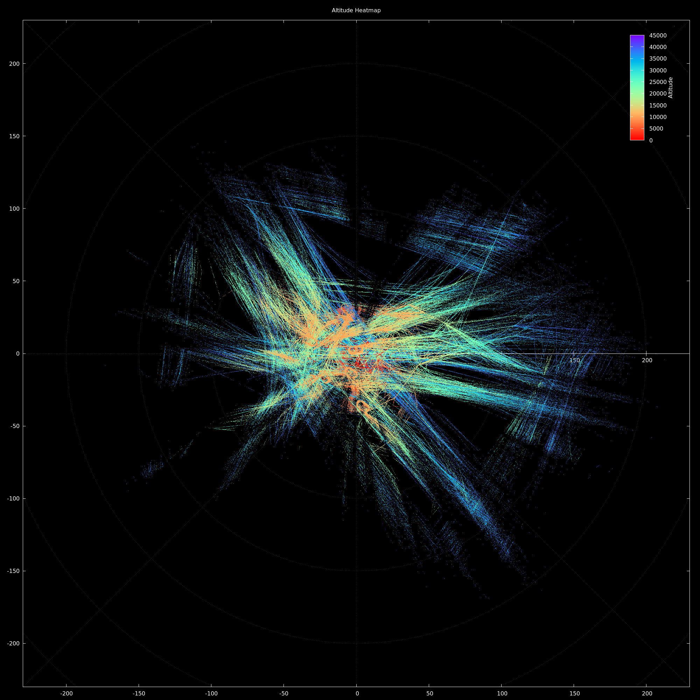

# Collection of scripts for visualising ADS-B data and characterising receiver performance.

All scripts here use gnuplot.

## compare.sh

This script obtains data from the rrd database collected with [graphs1090](https://github.com/wiedehopf/graphs1090) by wiedehopf.

Usage is:
```
./compare.sh <date1> <duration1> <date2> <duration2>
```
where the dates are the start date of each period and duration is how long in days to compare. eg:
```
./compare.sh 2019-07-10 10 2019-08-01 7
```
Example output comparing two different LNAs:



## polar.sh

This script uses data collected either directly from dump1090-fa, or from [timelapse1090](https://github.com/wiedehopf/timelapse1090).
It collects aircraft positions, altitudes and signal strengths, and then calculates azimuth, range and elevation to each aircraft from the receiver position.
Points are coloured by signal strength, and can be used to help identify receiver blindspots or terrain limitations.
Plots produced include:

* Azimuth/Elevation plot.
* Position/Signal strength heatmaps for high, low, and all altitudes.
* Range/Altitude plot.

To collect live data give the first argument as duration in minutes, and the second as the interval in seconds between samples:
You need to set your receiver location and height in metres at the top of the script prior to running.

```
./polar.sh 120 5
```

Alternatively, invoke the script like this to use data collected by timelapse1090:
```
bash polar.sh -1
```

If run directly on the pi collecting data, local data will be used. If run on a separate machine, it will attempt to retrieve the data from the pi specified at the top of the script and then generate the graphs.
This is recommended if plotting long periods and short intervals due to the large number of data points generated.
Data collected is saved in a file similar to polarheatmap-2019-08-05.

Example output:











## altitudes.sh

This script uses data generated by polar.sh to plot a position heatmap coloured by altitudes.
Usage example:
```
./altitude.sh polarheatmap-2019-08-05
```




## heatmap.sh

Original heatmap script. Usage is similar to polar.sh, except it must be run on the local machine. Plots are made using latitude and longitude directly, so while accurate may be a little distorted depending on your latitude.

